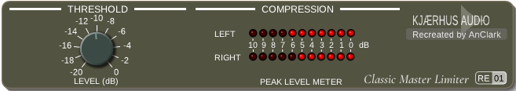

# Classic Master Limiter RE-01

Classic Master Limiter RE-01 is a reverse-engineered recreation of Kjaerhus Audio's Classic Master Limiter, a 32-bit Delphi VST2 mastering limiter from the early 2000s. This project reimplements the original signal path in a modern DPF-based codebase while keeping the original look and behavior in mind.



## Background

Classic Master Limiter was part of the Kjaerhus Classic series. The original plugin provided a compact brickwall limiter with look-ahead processing, threshold control, and gain-reduction metering. It shipped as a Windows-only 32-bit VST2 effect. Sadly, in early 2010s, Kjaerhus Audio discontinued, leaving Classic series unmaintained. 32-bit Win32 VST2 format made it difficult to use in modern 64-bit-only DAWs, and non-Windows platforms (macOS, Linux).

This repository recreates that plugin from reverse-engineering work and source analysis so it can be built and used on current systems.

## Features

- 3 ms look-ahead brickwall limiter.
- Three-stage gain envelope with attack and release smoothing.
- Threshold control from -20 dB to 0 dB.
- Independent left and right gain-reduction meters.
- Cubic soft-clip overshoot suppression.
- Low-level triangular dither.
- Modern DPF-based implementation with a recreated GUI.
- Cross-platform support for Windows, macOS and Linux.
- Plugin targets for VST2, VST3, and CLAP, plus optional JACK standalone.

## How to Compile

To compile Classic Master Limiter RE-01, you need:

- CMake 3.15 or higher
- A C++ compiler with C++14 support
- The DPF submodule checked out in `dpf/`

1. Clone the repository:

   ```bash
   git clone --recurse-submodules https://github.com/AnClark/ClassicMasterLimiter-RE01.git
   cd ClassicMasterLimiter-RE01
   ```

2. Configure and build:

   ```bash
   cmake -S . -B build -DCMAKE_BUILD_TYPE=Release
   cmake --build build
   ```

3. The generated plugin binaries will be placed in `build/bin`.

If you want the optional JACK standalone target, enable it during configuration:

```bash
cmake -S . -B build -DCMAKE_BUILD_TYPE=Release -DCONFIG_BUILD_JACK_STANDALONE=ON
cmake --build build
```

## Build Classic Master Limiter by Pipeline

This repository includes Makefiles for scripted builds and packaging.

### Native build for current platform

Open a Unix-compatible environment, then run:

```bash
make
```

You will get a package file named like `build/ClassicMasterLimiter-RE01-{ARCH}-{OS}-{VERSION}-{GIT_COMMIT_ID}.zip`.

### Cross-build for Windows on Linux / macOS

Use the cross-build Makefile:

```bash
make -f Makefile.win32_cross.mk
```

### Dependency check

The Makefiles will report missing dependencies. Inspect the source and build output for the exact packages required on your platform.

## Tools Used

- **Ghidra**: for disassembling and decompiling the original plugin binary.
- **IDR**: for recovering Delphi-specific symbols and structures.
- **Dhrake**: for applying the generated IDC script to the Ghidra project.
- **Claude Sonnet 4.6**: for research and development assistance. Core DSP logic, and some UI components (chassis, LED) were written by Claude.

## Disclaimer

This project is an independent reverse-engineering effort and is not affiliated with Kjaerhus Audio or Acoustica LLC.

The original Classic Master Limiter was developed by Kjaerhus Audio. This implementation is based on observed behavior and signal-processing analysis.

The Kjaerhus logo in the UI is used under fair use for identification purposes only.

## License

This project is licensed under the GPLv3 License. See the [LICENSE](LICENSE) file for details.

Components in `widgets/imgui-ext` and `widgets/imgui-knobs-mod` are licensed under the MIT License, while `widgets/dpf-imgui` is licensed under the ISC License. See the respective LICENSE files in those directories for details.
